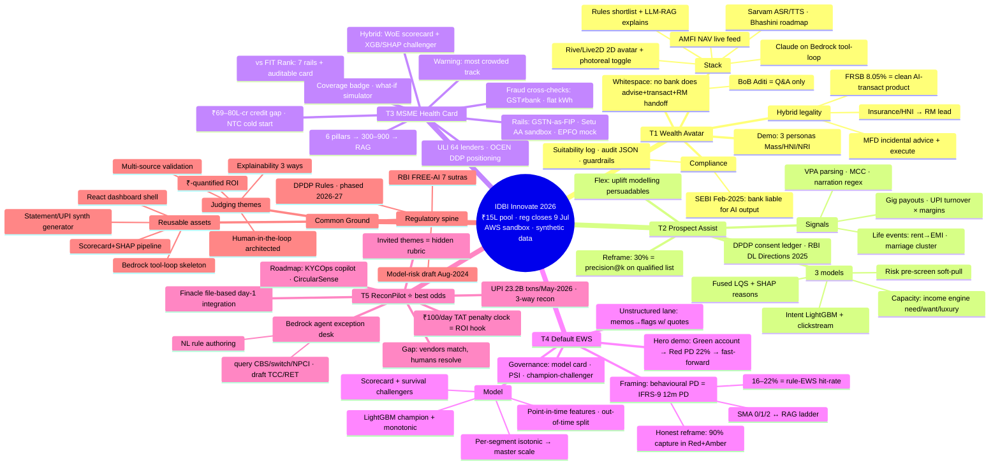

# IDBI Innovate 2026 — Master Mind Map

> Renders as a diagram on GitHub / any mermaid viewer. Interactive HTML version: see the published artifact.

## Reading order

1. `00-hackathon-overview.md` — rules, prizes, judging signals
2. `01-track-comparison-and-recommendation.md` — pick your track
3. `track-0X-*.md` — the curated plan for your track
4. `research/track-0X-research.md` — full cited evidence
5. `research/regulatory-landscape.md` + `research/india-stack-and-aws.md` — cross-cutting references
