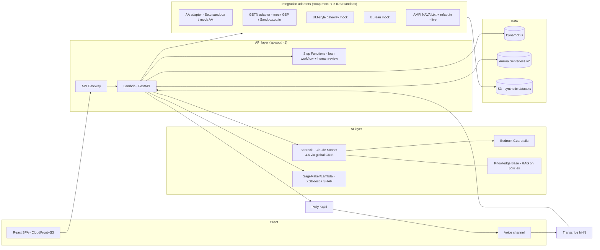

# India-Stack Integration + AWS Build Architecture — Technical Reference

**IDBI Innovate 2026 — cross-cutting reference for all 5 tracks**
*Researched: 4 July 2026. Companion to the regulatory doc and the 5 track docs — this one is TECHNICAL integration + build guidance only.*

**Ground rules recap:** hackathon runs on an AWS cloud sandbox with IDBI internal APIs + synthetic datasets; teams may bring their own APIs; AWS services preferred. Everything below is written so a 2–4 person team can build against **mocks first** and swap in real/IDBI APIs via an adapter layer (Section 8).

---

## 0. Integration decision matrix (read this first)

| Rail | Real sandbox usable by a hackathon team TODAY? | Demo strategy |
|---|---|---|
| Account Aggregator | **Yes** — Setu AA sandbox (easiest), Finvu | Setu sandbox live + own mock AA server as fallback |
| ULI (RBIH) | **No public sandbox** | Mock ULI-style gateway; quote real scale numbers |
| OCEN 4.0 | No open sandbox; specs public on ocen.dev/GitHub | Expose "OCEN-ready" endpoints matching the spec |
| GSTN | Via GSP sandboxes (Sandbox.co.in, Masters India, ClearTax) — signup friction varies | Mock GSTR-1/3B JSON; optionally 1 live GSP trial |
| EPFO | **No public API at all** | Mock ECR/passbook data; document consent workaround |
| DigiLocker / Udyam | Partner/API-Setu onboarding too slow for a hackathon | Mock issued-doc fetch + Udyam verify response |
| UPI txn data | Banks see it internally (IDBI sandbox may expose) | Synthetic UPI statement generator (Section 7) |
| Credit bureaus | No self-serve sandbox (CIBIL/Experian/CRIF) | Mock bureau JSON (score + tradelines + DPD strings) |
| AMFI NAV | **Yes, free, no signup** — NAVAll.txt + mfapi.in | Use live |
| NSE/BSE | Official feeds paid | Static CSV snapshots / yfinance `.NS` |

---

## 1. Account Aggregator — hands-on

### 1.1 Canonical specs (build your mock from these)

- **Sahamati standards repo:** https://github.com/Sahamati/account-aggregator-standards — `specs/` folder holds the three OpenAPI YAMLs: **`aa.yaml`** (AA APIs), **`fip.yaml`** (FIP APIs), **`fiu.yaml`** (FIU callback APIs); `schemas/` holds **XSD schemas per FI type** (deposit, credit card, etc.). Latest tagged release is old (v1.1.2, May 2021) — treat the repo as the machine-readable companion and ReBIT as authoritative.
- **ReBIT specifications portal (authoritative):** https://api.rebit.org.in/ and https://specifications.rebit.org.in/. Current major line is **ReBIT 2.x** — **v2.0.0 published 9 Aug 2023** (PDF: https://specifications.rebit.org.in/artefacts/NBFC-AA_API_Specification_v2.0.0.pdf), with the ecosystem migration tracked in Sahamati's repo https://github.com/Sahamati/Ecosystem-Readiness-for-ReBIT-2.x-specs (AA/FIP/FIU go-live process docs). Point releases (2.1.x) appear in ReBIT release notes (https://api.rebit.org.in/assets/ReleaseNotes.txt) — check that file during the hackathon for the exact current point version. **Note:** several live sandboxes (e.g., Finvu) still run **1.1.3**, so support both request shapes if you integrate live.
- **FI-type XSD schema docs (human-readable):** https://specifications.rebit.org.in/api_schema/account_aggregator/documentation/deposit.html — same path pattern for other FI types. The RBI Master Direction defines ~23 FI types; the ones tracks care about: `DEPOSIT`, `TERM_DEPOSIT`, `RECURRING_DEPOSIT`, `MUTUAL_FUNDS`, `EQUITIES`, `ETF`, `INSURANCE_POLICIES`, `NPS`, `GSTR1_3B` (GST returns as an FI type — GSTN acts as an FIP), plus bonds/CIS/AIF etc. Setu maintains a practical FI-data-types page: https://docs.setu.co/data/account-aggregator/fi-data-types.

### 1.2 Sandboxes ranked by "usable today"

1. **Setu AA (easiest — recommended live option).** https://docs.setu.co/data/account-aggregator/overview — self-serve dev signup via The Bridge dashboard, HTTP APIs, **built-in mock FIP returning data across multiple FI types**, embeddable consent-approval UI, and a **sample app on GitHub built against the sandbox**. Custom mock data configurable by emailing aa@setu.co. A team can be fetching mock FI data within hours: create consent → user approves in hosted screen → poll data session → fetch decrypted JSON.
2. **Finvu.** https://finvu.github.io/sandbox/ — pure REST (JSON over HTTPS), ReBIT **1.1.3**, three credentials (`fip_api_key`, `client_api_key`, detached **`x-jws-signature`** header on all calls). Getting credentials requires emailing support@cookiejar.co.in — friction: 1–3 days.
3. **Onemoney / Anumati (Perfios) / NADL** — developer portals exist but access is sales-mediated (forms, agreements); assume ≥1 week. Not hackathon-friendly. **Yodlee** is a global aggregator, not an RBI-licensed AA — skip for AA demos.

### 1.3 Recommended pattern: mock AA server from the OpenAPI specs

Even with Setu, build a **mock AA** so your demo never depends on someone else's uptime, and so judges see IDBI-sandbox-swappability:

1. Codegen FastAPI stubs from `aa.yaml`/`fip.yaml` (e.g., `fastapi-codegen` or hand-roll the 6 endpoints that matter).
2. Implement the consent lifecycle: `POST /Consent` → status `PENDING` → simulate user approval → `ACTIVE`; `POST /FI/request` → session ID → `GET /FI/fetch/{sessionId}` returns FI data.
3. **Simplify crypto for the demo:** the real spec uses ECDH key exchange + encrypted FI payloads and JWS-signed requests. In the mock, return plaintext XML/JSON conforming to the XSDs, and stamp a fake `x-jws-signature` — state this simplification on the architecture slide (judges reward honesty on security posture).
4. Generate FI payloads from your synthetic-data engine (Section 7) so the same personas flow through AA, GST, and bureau mocks coherently.

Sequence to demo: FIU app → consent request → (show consent artefact JSON: purpose code, FI types, date range, frequency — this is the **explainability + consent** story judges want) → data session → render analysed statement.

---

## 2. ULI (Unified Lending Interface)

- **Who runs it:** Reserve Bank Innovation Hub (RBIH). Project page: https://rbihub.in/projects/unified-lending-interface; docs portal: https://docs.rbihub.in/unified-lending-interface (JS-rendered SPA — content not crawlable; no self-serve developer signup found).
- **Architecture:** a universal **API gateway covering the entire loan lifecycle** — identity verification, eligibility, application, e-sign/e-stamp of digital agreements, electronic lien marking, and disbursement, all via API calls. It gives lenders **consent-based** access to financial + non-financial + alternate data: digitised state land records, milk-pouring data from dairy federations, satellite data, property search, PAN/KYC, and AA-routed financial data. All responses use **common standardised schemas, returned in under 1 second** (https://www.iifl.com/blogs/Other/what-is-uli-unified-lending-interface, https://rbihub.in/projects/unified-lending-interface).
- **Scale (as of 12 Dec 2025):** **64 lenders live (41 banks + 23 NBFCs)**, up from 36 a year earlier (~78% YoY growth); **136+ data services** (up from ~50); **12 loan journeys** supported (kisan credit card, dairy, MSME, personal, home-loan journeys, etc.) — https://www.medianama.com/2026/01/223-unified-lending-interface-64-lenders-136-data-services/. RBI positioning: "no longer a pilot — becoming core digital public infrastructure for lending."
- **Integration path for a bank:** institutional onboarding with RBIH (agreement + technical integration to the ULI gateway; lender consumes data services and plugs its LOS into the standardised journeys). **There is no public sandbox** for hackathon teams.
- **Mock strategy:** build a `uli-gateway` mock service exposing 4–6 "data services" behind one consistent envelope (`{request_id, consent_ref, service: "land-records|gstn|aa-deposit|satellite-crop", data: {...}, fetched_in_ms}`). Demo line: *"When IDBI onboards this journey to ULI, this adapter is the only layer that changes."* That is exactly the ULI value proposition and shows architectural literacy.

---

## 3. OCEN 4.0

- **Spec home:** https://ocen.dev/ (protocol docs at https://ocen.dev/docs/, previous pilots at https://ocen.dev/docs/previous_pilots/); maintained by iSPIRT with API specs + registries (Participant Registry, **Products Registry** — new in 4.0). OCEN 4.0 also formalised the Products Network collaboration framework (https://perfios.ai/resources/blogs/unveiling-ocen-4-0-open-credit-enablement-network-whats-new/).
- **Roles (4.0 terminology):** **BA** (Borrower Agent — fronts the borrower, e.g., a marketplace/app), **LA** (Lender Agent — fronts the lender), **LSP** (Loan Service Provider — the pre-4.0 umbrella term for borrower-side platforms, largely subsumed by BA in 4.0), **TSP** (Technology Service Provider — integrators that implement the protocol for participants), **DA** (Derived Agent — participants deriving/combining roles per the participant registry). Verify exact role definitions against ocen.dev/docs during build week — 4.0 renamed roles relative to most blog coverage.
- **GeM Sahay (flagship pilot) results:** in **Q1 FY2026 the network did 35,485 loans worth ₹1,124.84 crore (reported as "112,484 Lacs"), a 468% YoY surge in disbursement value; 6 lenders live (large PSUs to NBFCs)** with more integrating; purchase-order financing extended to MSME suppliers of CGDA; non-sole-proprietor borrower pilot underway; lenders report negligibly low delinquency on cash-flow-based lending (https://pn.ispirt.in/tag/gem-sahay/).
- **Honest 2026 status:** real and growing, but still **pilot-scale** (single-digit lender count on the flagship program; ~₹1.1k crore/quarter vs ULI's whole-of-market ambition). RBI's institutional weight is behind **ULI**; OCEN remains the open-protocol pattern for **embedded credit distribution**. In a bank pitch, position OCEN as the standard your MSME-lending APIs should be *conformant with*, not a rail you depend on today.
- **How to show "OCEN-ready" in a demo:** implement your loan-origination API using OCEN message shapes and names — `POST /loanApplications/createLoanApplicationsRequest`, consent + KYC blocks, `productId` referencing a Products-Registry-style catalog entry, webhook-based async responses with `ack` semantics. One slide: your API next to the OCEN spec excerpt, diff-highlighted. Cheap to do, high judge-signal.

---

## 4. GSTN developer access

### 4.1 The GSP/ASP model

GSTN does not give developers direct production API access. **GSPs (GST Suvidha Providers)** are licensed intermediaries with full API access; **ASPs** (application service providers — you) ride on a GSP's pipes. To build: either become a GSP (months, audits — no) or **partner with a GSP for sandbox + production credentials** (https://cleartax.in/s/gst-api-access, https://www.mastersindia.co/goods-and-services-tax-gst-api/).

- **Official developer portal:** https://developer.gst.gov.in/apiportal/ — full API specs (schemas, sample requests/responses), sample code, public keys, sandbox info. APIs are versioned and "still evolving"; changes announced via the portal and GSP discussion group.

### 4.2 Returns APIs (taxpayer-consented, via GSP)

- **GSTR-1** (outward supplies — invoice-level B2B/B2C), **GSTR-3B** (monthly summary: table 3.1 outward taxable turnover + tax paid), **GSTR-2A/2B** (auto-drafted inward). Flow: taxpayer grants API access on the GST portal → OTP-based auth → session token → GET returns data. For lending use-cases, GSTR-3B turnover + filing regularity are the core signals.

### 4.3 Free/public APIs (no taxpayer consent needed)

Published under the portal's **Public API** category (exact paths on developer.gst.gov.in; served through GSP base URLs):

- **Search Taxpayer by GSTIN** — `GET /commonapi/v1.1/search?action=TP&gstin={GSTIN}` → legal name, trade name, registration date, taxpayer type, status (active/cancelled), principal place of business, jurisdiction.
- **Returns filing status** — `GET /commonapi/v1.0/returns/{gstin}?fy={FY}` → list of return periods with filing dates and status (the "filing regularity" signal).
- Confirm exact current paths in the portal's Public API docs — versions move; the capability set (search + filing status, consent-free) is stable.

### 4.4 e-Invoice (IRP)

Separate rail: Invoice Registration Portals issue IRNs for B2B invoices of notified taxpayers. Official API sandbox with its own onboarding: https://sandbox.einvoice5.gst.gov.in/apiSpecification/authenicationdetail?url=FAQs (test credentials, mock GSTINs and invoices supplied by the sandbox). Relevant if a track does invoice financing / e-invoice-verified cash-flow lending.

### 4.5 Commercial GST API vendors (sandbox friction ranked)

| Vendor | Notes |
|---|---|
| **Sandbox.co.in** | Most developer-friendly: public docs (https://developer.sandbox.co.in/api-reference/gst/overview), self-serve signup, published pay-per-call pricing, GST search + returns + e-invoice + Udyam/PAN APIs |
| **Masters India** | GSP; GST + e-invoice + e-way bill APIs (https://www.mastersindia.co/goods-and-services-tax-gst-api/); pricing on request |
| **ClearTax** | GSP; enterprise-oriented, sales-mediated (https://cleartax.in/s/gst-api-access) |
| **Karza (Perfios)** / **Signzy** | KYB bundles incl. GSTIN search, GSTR pulls, Udyam; sales-mediated, no public pricing |
| **MasterGST / WhiteBooks / Vayana** | Additional GSPs with dev portals (https://mastergst.com/gst/gst-developer-api-portal.html) |

### 4.6 What to mock

Mock the **taxpayer-consented** surface (that's what needs signup): a `mock-gsp` service returning (a) GSTR-3B summary JSON per month (turnover, tax paid, filing date), (b) GSTR-1 B2B invoice lists, (c) filing-status timeline with a couple of late filings for your stressed persona. Keep the free public search live via Sandbox.co.in if signup goes through; otherwise mock it too — same adapter interface.

## 5. Other rails — quick reference

### 5.1 EPFO (formal-employment signal)

- **Access reality: there is no public EPFO API.** ECR (Electronic Challan-cum-Return) data lives in the employer portal; member passbooks at passbook.epfindia.gov.in behind member login. Scraping is against ToS and brittle.
- **Legitimate patterns:** (a) **employer-consent**: employer exports ECR/challan files and uploads them (fine for MSME-underwriting demos — the borrower IS the employer); (b) **employee-consent**: user downloads their PF passbook PDF and uploads it — parse with Textract; (c) AA framework: EPFO has been slated to join as an FIP — check status at demo time, don't depend on it.
- **Mock:** ECR-style monthly records `{uan, member_name, wages, epf_contribution, month}` — 12–24 months, headcount trends for the MSME persona.

### 5.2 Udyam (MSME registration)

No free official verification API. Verify page: https://udyamregistration.gov.in. Commercial verify-by-Udyam-number APIs: Sandbox.co.in, Karza/Perfios, Signzy. Mock response: `{udyam_no, enterprise_name, major_activity, nic_codes, classification: MICRO|SMALL|MEDIUM, date_of_registration, state}`.

### 5.3 DigiLocker (issued documents)

MeitY-run; **Issued Documents API** lets a consented user share machine-readable XMLs (Aadhaar-linked driving licence, PAN VC, vehicle RC, CBSE marksheets, and importantly **Udyam certificate** and insurance policies). Requester onboarding (via digilocker.gov.in partner APIs / API Setu) requires org approval — weeks, not days. **Mock** the OAuth-style flow: "Fetch from DigiLocker" button → consent screen → returns signed-XML-shaped JSON. Demo-honest and visually convincing.

### 5.4 UPI transaction data (what a bank actually sees)

Banks don't need an "API" — they *are* a party to each UPI txn and receive **NPCI settlement/raw files** plus their own CBS/switch records. Fields your synthetic data should replicate:

- `RRN` (retrieval reference number, 12-digit), `UTR`, txn ID (`payer PSP prefix + ...`), timestamp, amount, payer VPA, payee VPA, payer/payee account+IFSC, **MCC** (ISO 18245 merchant category code — 4 digits; P2P is MCC 0000), txn type (P2P/P2M), remarks/narration.
- **VPA parsing for merchant categorization:** `handle` after `@` maps to PSP (`@ybl`=PhonePe/Yes, `@okaxis`=GPay/Axis, `@paytm`, `@ibl`, `@axl`); prefixes signal merchant type: `paytmqr…`, `bharatpe.9…`, `q123456789@ybl` (PhonePe merchant QR), `getepay.…`, vs human-readable P2P VPAs (`name.surname@okhdfcbank`). Regex over prefix + handle + narration + MCC ⇒ merchant category — a genuinely demo-able feature (cash-flow categorization for underwriting).

### 5.5 Credit bureaus

CIBIL (TransUnion), Experian, Equifax, **CRIF High Mark** all require membership agreements — **no self-serve sandbox**. Fintech programs exist (CRIF/Experian partner APIs via aggregators like Signzy/Karza) but not in hackathon timeframes. **Mock a bureau report JSON:** `{score: 741, score_factors: [...], enquiries_6m, tradelines: [{type: "Personal Loan", sanctioned, outstanding, dpd_grid: "000|000|030|000|..."}]}` — the 36-month DPD grid string is the authentic detail; use it to drive your risk features and explainability display.

### 5.6 Market data

- **AMFI NAV (free, no auth):** daily all-schemes dump `https://portal.amfiindia.com/spages/NAVAll.txt` (semicolon-delimited: scheme code; ISIN; name; NAV; date). Community JSON API: **https://www.mfapi.in/** — `GET https://api.mfapi.in/mf/{schemeCode}` returns full NAV history free. Use live in wealth/portfolio tracks.
- **NSE/BSE:** official real-time feeds are paid (NSE Data & Analytics). Hackathon options: `yfinance` with `.NS`/`.BO` suffixes (delayed, ToS gray-zone), NSE website JSON endpoints (aggressively rate-limited), or — recommended — **static CSV snapshots** committed to the repo (bhavcopy from nsearchives) refreshed manually. A demo does not need live ticks.

### 5.7 Legal / entity / adverse media

- **e-Courts:** no official public API; NJDG dashboards are public HTML. Commercial case-search APIs: Surepass, Legalkart, and API Setu hosts limited eCourts APIs (services.ecourts.gov.in has CAPTCHA). Mock a `case_search(name, father_name, state)` response for KYC tracks.
- **MCA:** free company master-data search on mca.gov.in (no API); structured company data via **Probe42**, Karza, Signzy (paid). Mock `{cin, company_name, status, directors[], charges[]}` — charges (registered loans) are the useful lending signal.
- **News/adverse media:** **GDELT** (free, global news graph, https://www.gdeltproject.org), NewsAPI.org (free dev tier), OpenSanctions (https://www.opensanctions.org — free bulk data incl. OFAC/UN/RBI-defaulter-adjacent lists), Google Programmable Search, or LLM-native search APIs (Tavily/Exa free tiers). For an EWS/fraud track: GDELT + OpenSanctions gives a credible free adverse-media screen.

---

## 6. AWS reference architecture

### 6.1 Amazon Bedrock in ap-south-1 (Mumbai), mid-2026

- **~61 models live in ap-south-1** across Amazon, Anthropic, Cohere, DeepSeek, Google and others (tracker updated Jun 2026: https://modelavailability.com/platforms/aws/regions/ap-south-1). Authoritative list: https://docs.aws.amazon.com/bedrock/latest/userguide/models-regions.html.
- **Claude in India:** via **Global cross-Region inference**, Mumbai-based apps can call the latest Claude models — **Claude Opus 4.6, Sonnet 4.6, Haiku 4.5** (AWS blog: https://aws.amazon.com/blogs/machine-learning/access-anthropic-claude-models-in-india-on-amazon-bedrock-with-global-cross-region-inference/). Use inference profiles (`global.anthropic...` / `apac.anthropic...`). **Caveat for the bank audience:** global CRIS can route inference outside India — fine for hackathon synthetic data; flag "in-region or APAC-geo profiles for production data-residency" on your slide. **Amazon Nova** family (Micro/Lite/Pro) is available in-region as a low-cost/low-latency tier.
- **Platform features:** Mumbai has full core Bedrock capability — **Knowledge Bases** (RAG over S3 + OpenSearch Serverless/Aurora pgvector), **Guardrails** (PII masking, denied topics — perfect for the human-in-the-loop/compliance judging theme), **Bedrock Agents**, and **Bedrock AgentCore** (Runtime available in Mumbai; Policy GA Mar 2026 incl. Mumbai; Evaluations GA incl. Mumbai) — https://docs.aws.amazon.com/bedrock-agentcore/latest/devguide/agentcore-regions.html, https://aws.amazon.com/about-aws/whats-new/2026/03/policy-amazon-bedrock-agentcore-generally-available/.
- **Recommendation per track:** agentic orchestration → AgentCore Runtime or plain Lambda + Claude tool-use (simpler to debug in a week); RAG on circulars/policies → Knowledge Bases; every user-facing LLM output through **Guardrails** + a human-approval step (judging theme).

### 6.2 Classical ML: SageMaker

- **XGBoost** built-in container or script mode; **LightGBM** via SageMaker JumpStart/script mode. Train on synthetic loan book (Section 7), deploy to a **serverless inference endpoint** (zero idle cost) or just pickle the model into the Lambda layer if <250 MB — honest and cheaper for a demo.
- **Explainability = judging theme:** ship **SHAP** values with every score (SageMaker Clarify or `shap` in the endpoint container); render top-5 reason codes in the UI next to the score. This one feature differentiates more than model accuracy.

### 6.3 Serverless application pattern

- **API Gateway (HTTP API) + Lambda (FastAPI via Mangum, or Lambda Web Adapter) + DynamoDB** for hot paths; **Aurora Serverless v2 Postgres** if you need SQL/joins for statement analytics; **Step Functions** for the loan-workflow state machine (apply → data-pull → score → human review → sanction) — the Step Functions console visualization doubles as a live architecture demo; **EventBridge** for EWS-style event triggers; **S3 + CloudFront** for the React frontend; **Cognito** for demo auth.

### 6.4 Document, speech, and language AI

| Service | Indic capability (verify at build time) | Use |
|---|---|---|
| **Textract** | Forms/tables/queries on printed English docs; no Hindi handwriting. For Hindi/vernacular docs use **Claude vision via Bedrock** instead | Bank statements, GST certificates, KYC docs |
| **Transcribe** | 31+ languages incl. **hi-IN, en-IN, ta-IN, te-IN**; streaming for hi-IN/en-IN (https://docs.aws.amazon.com/transcribe/latest/dg/supported-languages.html) | Voice-banking ASR |
| **Polly** | **Kajal (neural, bilingual hi-IN + en-IN — code-switches within a sentence)**; Aditi (standard, bilingual) (https://docs.aws.amazon.com/polly/latest/dg/supported-languages.html, https://aws.amazon.com/about-aws/whats-new/2022/07/amazon-polly-neural-tts-support-hindi-indian-english/) | Voice-banking TTS — Kajal handles Hinglish, the killer demo detail |
| **Translate** | 75 languages incl. Hindi, Tamil, Telugu, Bengali, Marathi, Gujarati, Kannada, Malayalam, Punjabi, Urdu | Multilingual UI/notices |
| **Sarvam AI (BYO API)** | `api.sarvam.ai`: Saarika (ASR, ~11 Indic langs), Bulbul (TTS), Mayura (translation), Sarvam-M LLM; free trial credits; noticeably better vernacular ASR/TTS quality | Fallback/upgrade for Indic voice; allowed since teams may bring their own APIs |

**Voice pattern:** Transcribe streaming (hi-IN) → Claude on Bedrock (intent + tool-use against your APIs) → Polly Kajal. Swap ends for Sarvam if Hindi quality disappoints in testing — keep it behind the adapter interface.

### 6.5 Dashboards: QuickSight vs custom React

- **QuickSight**: fast aggregate dashboards, embedding costs extra, limited theming — fine for an "ops/portfolio view" slide.
- **Custom React + Recharts/Tremor**: recommended for the judged demo — you control the narrative flow, can animate the consent → data → score → explanation journey, and reuse components across all 5 tracks. Verdict: **React for the demo, QuickSight only if a track needs a portfolio-monitoring view quickly.**

### 6.6 Indicative demo-week cost (one team, us-style pricing, Mumbai)

| Item | Estimate |
|---|---|
| Bedrock (Claude Sonnet-class, ~2–5M tokens dev + demo) | $15–50 |
| Bedrock Nova/Haiku for high-volume synthetic-data gen | $5–15 |
| Lambda + API GW + DynamoDB (dev traffic) | <$5 (mostly free tier) |
| Aurora Serverless v2 (if used, 0.5 ACU min) | ~$10–25/week |
| SageMaker training (few XGBoost runs, ml.m5.xlarge spot) | $2–10 |
| Transcribe/Polly/Textract (demo volumes) | $5–15 |
| OpenSearch Serverless for Knowledge Base (min OCUs) | ~$25–50/week — **biggest trap; use Aurora pgvector or S3 Vectors instead if cost-sensitive** |
| **Total** | **~$60–170 for the week; <$100 if you avoid OpenSearch Serverless and Aurora** |

### 6.7 Reference architecture (mermaid)



## 7. Synthetic-data strategy

The hackathon supplies synthetic datasets, but tracks will need **coherent multi-rail personas** the IDBI data may not provide. Build one generator, share across tracks.

### 7.1 Indian bank statements + UPI transactions

Generate per persona (salaried / MSME / stressed borrower):

- **Salary credits:** fixed day-of-month ±2 days, NEFT/IMPS narration `"NEFT-SALARY-{EMPLOYER}-{ref}"`, occasional bonus month.
- **EMI debits:** NACH/ECS narrations (`"ACH-D-{LENDER}-{loan_ref}"`), fixed amounts, bounce events (`"ACH RETURN CHARGES"`) for stressed personas — bounces are the EWS signal.
- **UPI spends:** realistic merchant name pools per category (Swiggy/Zomato/Blinkit; Jio/Airtel recharges; IRCTC; local kirana as `q{9digits}@ybl` P2M), **VPA formats per Section 5.4**, MCC distribution skewed to 5411/5812/4121/4899, P2P transfers to family VPAs, festival-month spikes (Diwali/Eid), weekend patterns.
- **MSME variant:** customer-payment credits (mix of UPI P2M, NEFT with invoice refs), GST tax payments (`"GST PMT-06"` debits), vendor payments, weekly cash deposits.

### 7.2 Cross-rail coherence rules (this is what makes it credible)

1. **GST ↔ banking:** monthly bank business credits ≈ GSTR-3B outward taxable turnover × (0.85–1.05) + cash share; violations only for the "fraud/diversion" persona (a feature, not a bug — one track can detect it).
2. **Bureau ↔ statements:** every tradeline in the mock bureau report has a matching EMI debit stream; DPD grid entries align with bounce months.
3. **EPFO ↔ MSME:** ECR headcount × avg wage tracks the salary-debit total in the MSME's statement.
4. **Loan-book stress trajectories:** portfolio-level generator with DPD ladders (0→30→60→90→NPA) driven by a hazard rate you can shock (sector shock, rate shock) — gives EWS and portfolio tracks time-series to visualize.

### 7.3 Tools

- **Bedrock-generated synthetic data:** prompt Claude/Nova to emit JSON rows given persona + schema + few-shot examples — AWS documents this pattern for synthetic data generation on Bedrock (see AWS ML blog, "synthetic data generation with Bedrock" patterns). Best for narrations/merchant realism; cheap with Nova Micro/Haiku. Generate offline, commit CSVs — never generate live in the demo.
- **Faker** (`en_IN` locale: Indian names, addresses, phone numbers) + ~300 lines of custom generator for the rules above — the workhorse.
- **SDV (Synthetic Data Vault, https://sdv.dev):** GaussianCopula/CTGAN to expand a seed table while preserving correlations — use to blow up the loan book from a seeded 1k rows to 100k.

### 7.4 Open datasets to seed distributions

- **Kaggle Home Credit Default Risk** — feature distributions for retail credit risk.
- **LendingClub** loan data — loan-book fields, grades, charge-offs.
- **PKDD'99 Czech (Berka) bank dataset** — classic full relational bank (accounts, txns, loans) to sanity-check statement generators.
- RBI aggregate publications (sectoral NPA ratios) to calibrate portfolio stress levels; Kaggle "UPI transactions" datasets exist but are low-quality — use only for merchant-name pools.

---

## 8. Demo-week execution playbook

### 8.1 Monorepo structure (shared across all 5 tracks)

```
idbi-innovate/
├── backend/                 # one FastAPI app
│   ├── app/main.py
│   ├── app/adapters/        # THE key design (8.2)
│   │   ├── base.py          # Protocol interfaces per rail
│   │   ├── aa_{mock,setu}.py
│   │   ├── gst_{mock,sandboxco}.py
│   │   ├── bureau_mock.py  ─ uli_mock.py ─ market_amfi.py
│   │   └── idbi/            # thin wrappers, filled in on-site
│   ├── app/services/        # scoring, agents, ews, voice
│   ├── app/routers/track{1..5}.py
│   └── tests/
├── frontend/                # one React app (Vite + Tailwind + Recharts)
│   ├── src/components/      # ConsentCard, ScoreExplain(SHAP), StatementView, ChatAgent
│   └── src/pages/track{1..5}/
├── datagen/                 # Section 7 generators + committed CSVs
├── infra/                   # CDK or SAM (single stack, ap-south-1)
├── mocks/                   # standalone mock AA / mock GSP servers
└── docs/                    # arch diagrams, pitch material
```

### 8.2 Mock-API adapter design (so IDBI sandbox slots in later)

```python
class AAClient(Protocol):
    def create_consent(self, req: ConsentRequest) -> ConsentHandle: ...
    def fetch_fi(self, session_id: str) -> list[FIRecord]: ...

def get_aa_client() -> AAClient:          # factory, env-switched
    return {"mock": MockAA, "setu": SetuAA, "idbi": IDBIAA}[settings.AA_BACKEND]()
```

Rules: **normalize at the adapter boundary** (internal Pydantic models only — no upstream JSON past the adapter); every adapter has a `mock` twin returning Section-7 data; one `.env` flag flips a whole rail; log every adapter call to a "data-lineage" panel in the UI (consent + explainability story for judges). On-site, wiring IDBI sandbox APIs = writing `idbi/*.py` adapters only.

### 8.3 Pre-hackathon prep that stays within the rules

Rules allow AI coding agents and require original code written during/for the event — **verify IDBI's exact wording** on pre-built assets. Safe prep regardless:

- Research docs (this one), architecture diagrams, synthetic datasets (data ≠ code in most rulesets — confirm), spec familiarity (AA yaml, OCEN docs), AWS account hygiene (Bedrock model access enabled in ap-south-1 — **model-access grants can take time; request before demo week**), practiced CDK deploy of a hello-world stack, team-agreed component library choices.
- If pre-written code is disallowed: keep the monorepo as a **documented skeleton spec** (this file) and regenerate with AI agents on day 1 — the design above is rebuildable in hours with Claude Code.

### 8.4 Presentation stack

1. **Pitch deck (≤10 slides):** problem → persona → live-demo pointer → architecture (one slide, the mermaid above) → explainability/human-in-the-loop slide (judging theme) → India-stack integration map (matrix from Section 0) → production path (mock→IDBI→ULI/AA live) → cost/scale.
2. **Live demo:** scripted 3-minute happy path + one "stressed persona" moment (bounce detected → EWS alert → human review queue). Record a backup screen-capture the night before.
3. **Architecture slide** doubles as the answer to every "how would this work in production" question — rehearse it.

### 8.5 Team-role split (2–4 people)

| Role | Owns |
|---|---|
| **Backend/integrations** | FastAPI, adapters, mock servers, IDBI sandbox wiring on-site |
| **AI/ML** | Bedrock prompts/agents/Guardrails, XGBoost+SHAP, datagen |
| **Frontend/demo** | React app, demo script, ConsentCard/ScoreExplain components |
| **Pitch/domain (or shared)** | Deck, regulatory framing (companion doc), judge Q&A, timekeeping |

3-person team: merge pitch into frontend role. 2-person: backend+AI / frontend+pitch; cut scope to one golden-path journey per track, mocks only, no live sandbox.

---

## Source index (load-bearing)

- Sahamati AA standards: https://github.com/Sahamati/account-aggregator-standards · ReBIT: https://api.rebit.org.in/ · v2.0.0 PDF: https://specifications.rebit.org.in/artefacts/NBFC-AA_API_Specification_v2.0.0.pdf · 2.x readiness: https://github.com/Sahamati/Ecosystem-Readiness-for-ReBIT-2.x-specs
- Setu AA sandbox: https://docs.setu.co/data/account-aggregator/overview · Finvu sandbox: https://finvu.github.io/sandbox/
- ULI: https://rbihub.in/projects/unified-lending-interface · scale numbers: https://www.medianama.com/2026/01/223-unified-lending-interface-64-lenders-136-data-services/
- OCEN: https://ocen.dev/ · GeM Sahay results: https://pn.ispirt.in/tag/gem-sahay/ · OCEN 4.0 changes: https://perfios.ai/resources/blogs/unveiling-ocen-4-0-open-credit-enablement-network-whats-new/
- GSTN: https://developer.gst.gov.in/apiportal/ · e-invoice sandbox: https://sandbox.einvoice5.gst.gov.in · Sandbox.co.in GST: https://developer.sandbox.co.in/api-reference/gst/overview
- Bedrock Mumbai: https://docs.aws.amazon.com/bedrock/latest/userguide/models-regions.html · Claude in India via global CRIS: https://aws.amazon.com/blogs/machine-learning/access-anthropic-claude-models-in-india-on-amazon-bedrock-with-global-cross-region-inference/ · AgentCore regions: https://docs.aws.amazon.com/bedrock-agentcore/latest/devguide/agentcore-regions.html
- Transcribe languages: https://docs.aws.amazon.com/transcribe/latest/dg/supported-languages.html · Polly voices: https://docs.aws.amazon.com/polly/latest/dg/supported-languages.html
- AMFI NAV: https://portal.amfiindia.com/spages/NAVAll.txt · mfapi: https://www.mfapi.in/ · SDV: https://sdv.dev · OpenSanctions: https://www.opensanctions.org
